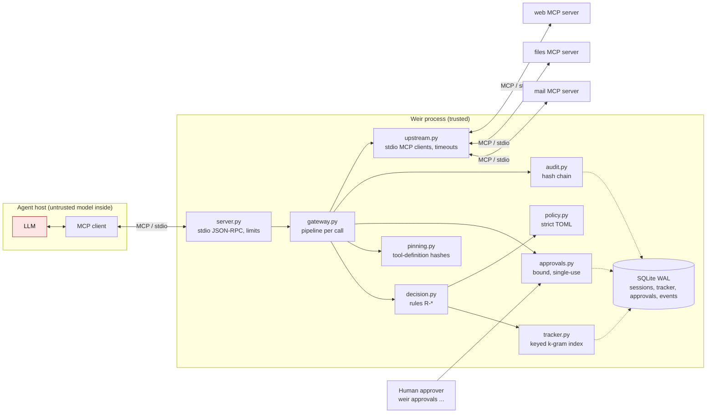
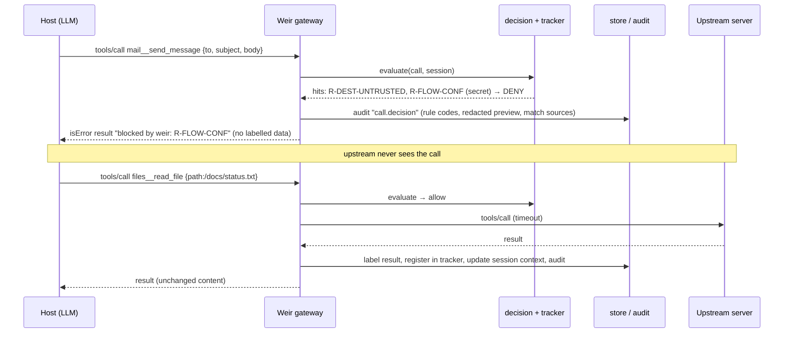
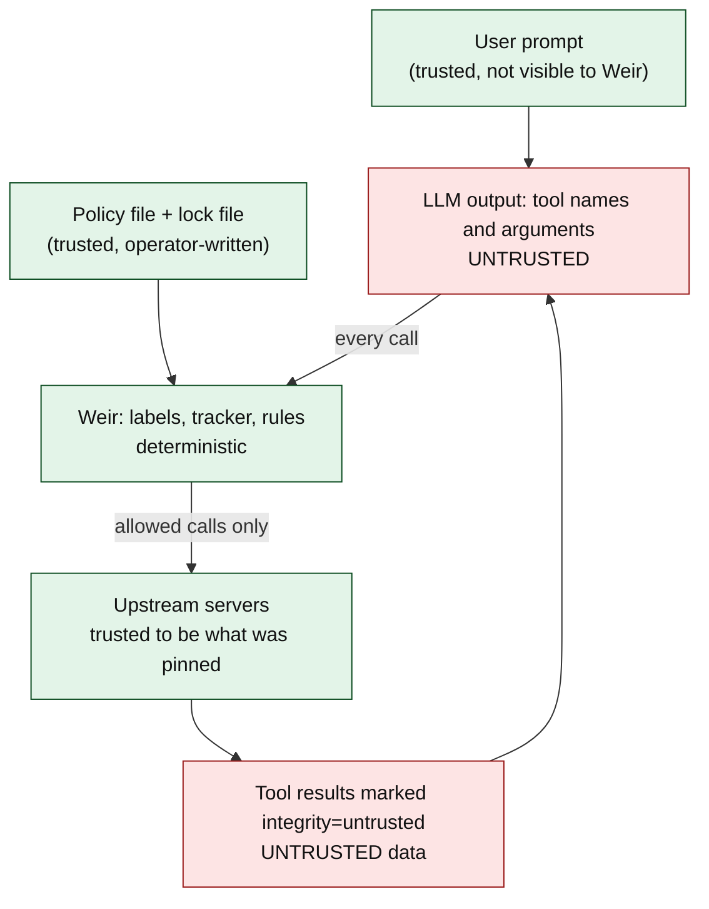

# Architecture

Weir is a gateway: to the agent host it is one MCP server, to each real MCP server it is a client. Everything it decides is made by ordinary code from three inputs: the operator's **policy**, the **session state** (what the agent has already been shown), and the **call** being attempted. There is no model inside it.

## 1 · Components

| Module | Responsibility | Depends on |
|---|---|---|
| `labels` | confidentiality × integrity lattice, join | nothing |
| `policy` | strict TOML loading, tool declarations, rule configuration; invalid policy refuses to start | `labels` |
| `destinations` | parse e-mail addresses and URLs; internal-vs-external classification; fails closed | nothing |
| `tracker` | normalise text, keyed k-gram and entity index, decode base64/hex/percent spans, match arguments | nothing |
| `decision` | evaluate rules in fixed order, return all hits and the most restrictive effect | `policy`, `tracker`, `destinations`, `labels` |
| `store` / `audit` / `approvals` | SQLite persistence; tamper-evident event chain; single-use approvals bound to the exact call | `sqlite3` |
| `pinning` | hash tool definitions, compare with a lock file | nothing |
| `upstream` | one asynchronous JSON-RPC client per real server: handshake, timeouts, crash detection, `list_changed` | nothing |
| `gateway` | the per-call pipeline (below); transport-agnostic | everything above |
| `server` | host-facing stdio MCP server; message-size limits, concurrent requests, cancellation | `gateway` |
| `report` | self-contained HTML flow trace from the audit chain | `audit` |

The library has **no third-party runtime dependencies** (standard library only). The official MCP SDK is a *test* dependency, used to prove interoperability from both sides.

## 2 · The per-call pipeline

Order of work for every `tools/call`, all inside one per-session critical section for the decision and again for the post-call update:

1. Resolve the namespaced tool in the policy (undeclared → deny).
2. Check the definition hash against the lock (changed → deny).
3. Classify destinations of the `target_args` (proper parsing; unparseable → external).
4. Match `target_args` and `content_args` against the session's tracker.
5. Evaluate every rule, collect all hits, take the most restrictive effect.
6. If approval is needed: create or consume a bound approval; otherwise deny or return the approval prompt.
7. Forward to the upstream with a timeout; map crashes and malformed replies to error results.
8. Label the result from the policy (using the arguments, e.g. path patterns), register its text in the tracker, join it into the session context, persist, audit, **then** return it to the host.

## 3 · Trust boundaries

The only things that cross from the model's side to the servers are calls that the rules allow or a human approved for that exact call. What returns to the model is whatever the server returned, **unmodified**; Weir does not sanitise or rewrite content in V1.

## 4 · Why two tiers

| Tier | Rules | Strength | Weakness |
|---|---|---|---|
| **Value** | `R-DEST-UNTRUSTED`, `R-FLOW-CONF` | cheap in utility: only calls whose arguments visibly contain labelled data are touched | heuristic: a transformed value (paraphrase, translation, small pieces) is invisible |
| **Session** | `R-TRIFECTA`, `R-UNTRUSTED-READ`, `R-EGRESS-BUDGET` | sound against a black-box model: needs no knowledge of what the model did with what it saw | expensive in utility: any session that mixed untrusted input and secrets is restricted, whether or not anything was misused |

The evaluation exists to measure exactly this trade-off.

## 5 · Data model (SQLite, WAL)

| Table | Columns | Notes |
|---|---|---|
| `meta` | key, value | schema version, HMAC key (see below) |
| `sessions` | id, created, policy_sha256, ctx_conf, ctx_integ, external_count, tracker (blob), version | restored on resume |
| `events` | seq, ts, session_id, kind, payload (JSON), prev_hash, hash | append-only chain, `hash = SHA-256(prev_hash ‖ canonical JSON of the row)` |
| `approvals` | id, session_id, call_hash, tool, rules, state, created, expires, resolved_at, consumed_at | state ∈ pending / approved / denied / consumed / expired |

**What is stored about labelled data.** Only keyed hashes (HMAC-SHA-256) of k-grams and entities, lengths and labels. No plaintext of a labelled value is written by the tracker, and audit payloads carry digests and short redacted previews. The key is kept in the same database file unless `WEIR_HMAC_KEY` is set, so this is hygiene against casual disclosure, **not** encryption: anyone holding the file could test guesses of low-entropy secrets.

## 6 · Failure behaviour in one table

See `docs/design/03-v1-spec.md` §8 for the required behaviour and `docs/evaluation.md` / `docs/red-team.md` for what was actually tested.

## 7 · Where the boundary ends

Weir sees tool calls and tool results. It cannot see the user's prompt, the model's reasoning, the final answer, or anything the host does with them. This is why the answer channel (G3) can only be protected by refusing or holding the **read** that would put the secret into the model's context, and why a host that renders model-chosen markdown images can leak data that Weir never sees.
